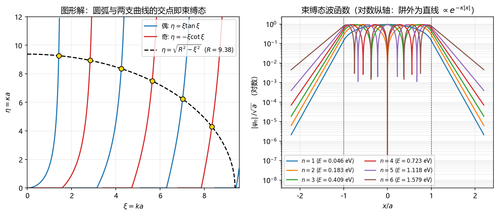

<!-- README_SYNC: source=working-tree; updated=2026-10-03 -->

<h1 align="center">量子力学习题求解 · quantum-mechanics-solver</h1>

<p align="center">
  <strong>不只给答案，而是把「题意识别 → 物理图像 → 分步推导 → 结果自检」整条链路走完。</strong>
</p>

<p align="center">
  面向本科与考研／竞赛的量子力学习题求解 Skill，<br>
  支持题目图片与文本输入，覆盖 13 类题型的标准解法路径，可用 sympy 做符号核验、matplotlib 出图，<br>
  并把每道题的「题目 + 解题过程」自动存入本地题库。
</p>

<!-- BADGES:BEGIN -->
<p align="center">
  <a href="https://github.com/timeti123553/quantum-mechanics-solver/stargazers"></a>
  
  
  
  
  <a href="./LICENSE"></a>
</p>
<!-- BADGES:END -->

<p align="center">
  如果你正在刷量子力学习题、准备考研或核对推导，欢迎把它留在本机长期使用——用得越多，题库越厚。
</p>

很多量子力学解答只有两种结局：要么"由薛定谔方程可得……"跳过全部推导，要么堆一大串公式却不解释为什么可以这样做。这个 Skill 两种都不做：它先把题目翻译成清晰的数学条件，用一句"关键在……"点出该题型的标准路径，再**编号分步**推导，每一步都交代依据（定理、近似、对易关系、边界条件、选择定则）。

它也不只是"讲一遍"。每道题都要过**量纲检查 + 极限／特例检查**，需要时调用脚本做符号积分、矩阵本征值、对易关系或数值复算；结论单独框出，并附易错点与变式。做完之后，题目与解题过程会**自动存入本地题库**，下次遇到同类题可以直接检索、复用或更新。

它还是一套可复现的工程：示例题目自带核验脚本与插图，一句话就能重跑出能级表、误差与图片。

## 它能帮你解决什么

| 你遇到的问题 | Skill 会怎么做 |
| --- | --- |
| 只有题目图片，公式看不清 | 逐字转录题意与全部公式，先给出转录供你核对；有歧义先问再解 |
| 不知道这题该用什么方法 | 先判题型（13 类判据表）并说明该类标准路径，再动手 |
| 推导中间步骤看不懂 | 编号分步，每步一句「为什么可以这样做」 |
| 结果对不对没把握 | 量纲检查 + 一个极限／特例核验，必要时用脚本数值复算 |
| 复杂积分、矩阵本征值、简并微扰 | 调 `qm.py` 用 sympy 精确求解，不靠手算硬扛 |
| 想要波函数／能级／概率密度的图 | 调 `qmplot.py` 出图，或生成可复现的核验脚本 |
| **上次解过的题找不到了** | **本地题库**：`search` 检索，命中可直接复用或用 `--update` 更新 |
| 解答里的公式渲染坏了 | 渲染硬约束 + `check_math_md.py` 自检，交付前先扫描 |

## 覆盖哪些题型

知识按题型分开维护，**只按当前题目加载必要参考**，不把整本手册塞进上下文。

| 领域 | 主要内容 |
| --- | --- |
| 波函数与概率 | 归一化、期望值、不确定度、概率流、Ehrenfest 定理、含时演化 |
| 一维定态 | 无限深阱、有限深阱、$\delta$ 势、双 $\delta$、周期势；奇偶分类与超越方程 |
| 一维散射 | 透射／反射系数、势垒与势阱、共振透射、概率流里的 $k$ 因子 |
| 谐振子 | 升降算符代数解、矩阵元、相干态、以 $x^3$／$x^4$ 为微扰 |
| 角动量与自旋 | $\hat L^2$／$\hat L_z$ 本征值、升降算符、泡利矩阵、磁场中的自旋与 Rabi 振荡 |
| 中心力场与氢原子 | 径向方程、$u=rR$ 变换、简并度计数、期望值与维里定理 |
| 定态微扰论 | 非简并一／二阶、简并子空间对角化、Stark 与 Zeeman 效应 |
| 含时微扰与跃迁 | 一阶跃迁振幅、Fermi 黄金规则、选择定则、突发／绝热近似 |
| 变分法与 WKB | 试探波函数上界、隧穿贯穿因子、半经典量子化条件 |
| 全同粒子 | 交换对称性、Slater 行列式、氦原子、交换能 |
| 矩阵力学与表象 | 本征分解、时间演化算符、二能级系统、密度矩阵 |
| 电磁场中的粒子 | 最小耦合、Landau 能级、规范变换、Aharonov–Bohm 相位 |
| 竞赛进阶 | 角动量合成与 CG 系数、Wigner–Eckart 定理、最小不确定态、量级估算 |

## 一个典型回答如何产生

```text
题目（图片 / 文本）
  → 逐字转录题意与公式，声明符号约定与缺省条件
  → 判题型，点出「关键在……」与该类的标准解法路径
  → 建模：出发方程 + 边界／连续条件 + 所用近似及其适用条件
  → 编号分步推导，每步说明依据
  → 定常数：归一化、边界条件、代数化简
  → 核验：量纲 + 极限／特例 + 守恒量 + 数值复算（必要时跑脚本）
  → 框出答案，补物理含义、易错点与变式
  → 存入本地题库，并给出存档路径
```

图片题会先给**转录结果**再给解答；缺条件的题会先问，或明确写成「假设……」并说明它对结果的影响。

## 题库存档（本地题库）

每次解题后，skill 会把**题目与解题过程**存到本地，便于查阅、复用与查重。条目带 YAML 头（编号、日期、题目、标签、难度、来源、题面指纹），索引按日期倒序自动重建。

| 能力 | 命令 |
| --- | --- |
| 解题前查重 | `python scripts/archive_problem.py search "深势阱"` |
| 解题后存档 | `python scripts/archive_problem.py add --file 草稿.md --title "…" --tags "…" --difficulty 考研` |
| 浏览 | `python scripts/archive_problem.py list [--tag 势阱]` |
| 查看单条 | `python scripts/archive_problem.py show 20261003-002` |

`add` 会用**题面指纹**自动查重：同一道题已存在时报出该记录编号（要更新用 `--update <id>`，确实是新题用 `--force`）。存档位置默认为 `references/local/archive/`，可用环境变量 `QM_ARCHIVE_DIR` 或 `--dir` 改到别处。

## ⚠️ 公式渲染硬约束（本机 GUI）

本机 DSH Web GUI 的 Markdown 渲染器**只识别同一行内开闭的 `$$...$$`**（前端源码里这条构造名为 `sameLineDollarMathFlow`，`multiline=false`）。跨行的 `$$` 不会被当作公式，KaTeX 也解析不了那段裸 TeX，渲染器会把内容**当纯文本原样输出**——后果是从那里开始的标题、加粗、表格、行内公式全部变成生文本，整段解答报废。

| # | 规则 |
| --- | --- |
| 1 | `$$...$$` 必须**单行开闭**，内部不能有换行 |
| 2 | `$$` 必须在**行首**（前面只能有空白） |
| 3 | 收尾的 `$$` 之后**只能是空白** |
| 4 | 行内 `$...$` **不能跨行** |

长公式拆成多个单行 `$$`；`\begin{cases}`／`\begin{aligned}` 整个环境压到一行、用 `\\` 在公式内部换行；确实需要跨行时用 `\[ ... \]`。交付前自检：

```bash
python scripts/check_math_md.py <文件或目录>        # 只检查
python scripts/check_math_md.py --fix <文件或目录>  # 自动把跨行 $$ 并成一行
```

## 示例

每个示例都是**可复现**的：题目、完整求解、插图与核验脚本放在同一个目录下，图片由脚本生成。

| 示例 | 题目 | 知识点 | 入口 |
| --- | --- | --- | --- |
| 01 | 一维有限深方势阱（深势阱） | 分段势定态、宇称守恒、超越方程与图形解、束缚态计数、深势阱极限 | [01-finite-square-well.md](<examples/01-finite-square-well.md>) |
| 02 | 一维奇异谐振子（isotonic oscillator） | 奇异势 $1/x^2$ 双重极点、指标方程、合流超几何与多项式截断、等间距能级、二重简并 | [02-isotonic-oscillator.md](<examples/02-isotonic-oscillator.md>) |

<p align="center">
  <a href="./examples/01-finite-square-well.md">
    
  </a>
</p>

<p align="center"><sub>示例 01：一维有限深方势阱的图形解（左）与束缚态的阱外指数尾（右）；点击图片查看完整解答</sub></p>

一键复现任意示例：

```bash
python examples/01-finite-square-well-check.py       # 深势阱：能级表 + 两张插图
python examples/02-isotonic-oscillator-check.py      # 奇异谐振子：解析 + 有限差分 + sympy 精确核验
```

## 脚本

```bash
python scripts/qm.py symbols                     # 打印可用符号与约定
python scripts/qm.py integrate "x**2*sin(n*pi*x/L)**2" -v x -a 0 -b L
python scripts/qm.py expect "sin(n*pi*x/L)" -v x -a 0 -b L --prob-range 0,L/2
python scripts/qm.py dsolve "psi'' + k**2*psi = 0" -f psi -v x
python scripts/qm.py eigen "[[E1, V],[V, E2]]"
python scripts/qm.py commute Lx Ly --def "Lx=y*pz-z*py" --def "Ly=z*px-x*pz"
python scripts/qm.py check "sqrt(2/L)*sin(pi*x/L)" --subs "L=1, x=0.5" --expected 1.41421356
python scripts/qmplot.py well --L 1 --n 1,2,3 --out well.png
python scripts/qmplot.py harmonic --n 0,1,2 --out sho.png
python scripts/qmplot.py levels --energies "1,4,9,16" --out levels.png
```

`qm.py` 覆盖 `integrate / expect / dsolve / eigen / series / limit / simplify / commute / check`；`qmplot.py` 覆盖 `well / harmonic / custom / levels / wavepacket`。两者都会**自动切换到本机装有 sympy／matplotlib 的解释器**，用哪个 Python 启动都不影响结果。

## 安装

将下面的安装口令发送给你使用的 AI 助手：

```text
请将公开仓库 https://github.com/timeti123553/quantum-mechanics-solver 下载并安装为本地 Skill。
```

或者手动安装：把仓库整个目录放到 DSH 的 skill 根目录下即可生效（保存即被发现，无需重启）。

安装完成后，可以输入：

```text
请使用 quantum-mechanics-solver 求解这道题：
（粘贴题目文字，或直接上传题目截图）
```

也可以直接用它管理题库、核对结果：

```text
请用 quantum-mechanics-solver 检索本地题库里关于「深势阱」的题目。
请用 quantum-mechanics-solver 核对我这个推导：$\langle x\rangle$ 是否等于 $L/2$？
请用 quantum-mechanics-solver 画出谐振子前三个定态的波函数与概率密度。
```

## 环境要求

| 项目 | 要求 |
| --- | --- |
| Python | 3.10+ |
| 依赖 | `sympy`、`scipy`、`matplotlib`、`numpy`（`check_math_md`、`archive_problem` 只需标准库） |
| 解释器解析顺序 | 环境变量 `QM_PYTHON` → `references/local/env.md` 记录的路径 → 常见安装位置 → 当前解释器 |
| 自检 | `python scripts/qmenv.py --need sympy,matplotlib` |

本机的实际解释器、沙箱与执行限制记录在 `references/local/env.md`（属于用户自己的信息）。

## 项目结构

```text
quantum-mechanics-solver/
├── SKILL.md                    # 核心指令：七步流程、题型速查、脚本用法、红线
├── README.md                   # 本文件（面向人）
├── LICENSE                     # MIT 许可
├── .gitignore                  # 排除 references/local/ 与 __pycache__
├── references/
│   ├── problem-types.md        # 13 类题型的判据 + 标准解法路径 + 该类陷阱
│   ├── formulas.md             # 公式／积分／特殊函数／对易关系／常数速查
│   ├── verification.md         # 结果自检清单 + 高频错因子
│   ├── output-format.md        # 解答模板、排版约定、公式渲染硬约束
│   └── local/                  # 【用户自己的信息，分享前请清空】
│       ├── env.md              # 本机解释器与执行环境
│       ├── preferences.md      # 用户约定的记号与风格
│       └── archive/            # 题库：每道题的「题目 + 解题过程」+ 索引
├── scripts/
│   ├── qmenv.py                # 解释器／依赖自动解析
│   ├── qm.py                   # 符号／数值工具箱
│   ├── qmplot.py               # 画图工具
│   ├── check_math_md.py        # Markdown 公式写法检查／修正
│   └── archive_problem.py      # 题库存档与检索
└── examples/
    ├── README.md               # 示例索引与新增示例的约定
    ├── 01-finite-square-well.md / -check.py / -graph.png / -levels.png
    └── 02-isotonic-oscillator.md / -check.py / -graph.png / -spectrum.png
```

## 设计原则

1. **先立物理图像，再动笔算。** 判清题型、点出关键，比抢着写公式更能避免走错路。
2. **不跳过推导，也不堆砌公式。** 每一步只做一件事，并说明「为什么可以这样做」。
3. **结果必须自检。** 每道题至少完成量纲检查与一个极限／特例检查，并写进解答。
4. **区分精确解与近似解。** 用近似就写明名称与适用条件（如 $ka\gg1$、非简并微扰的能级差条件）。
5. **脚本是校验器，不是替代品。** 主解答手写推导；没跑过的脚本结果不写成「数值验证得……」。
6. **不编造题目条件。** 缺条件就问，或明确写成假设并说明它对结果的影响。
7. **交付即存档。** 题目与解题过程落进题库，属于用户，可检索、可复用、可清空。

### 版本更新维护记录

| 日期 | 类型 | 更新 | 用户价值 |
| --- | --- | --- | --- |
| 2026-10-03 | 初始版本 | 建立 `SKILL.md` 七步流程、4 份 references（题型／公式／自检／排版）、3 个脚本（解释器解析、符号工具箱、画图）。 | 图片题与文本题都能按统一流程求解，需要时才加载对应参考。 |
| 2026-10-03 | 渲染修复 | 定位到前端 `sameLineDollarMathFlow`（`multiline=false`）硬约束；新增排版规范第 2 节与红线条目，配套 `check_math_md.py`，并把历史 17 处跨行 `$$` 全部并成单行。 | 修掉「一段公式毁掉整篇解答」的问题，交付前可自动扫描。 |
| 2026-10-03 | 示例与说明 | 新增 `examples/`（示例 01 深势阱：题目 + 求解 + 两张插图 + 核验脚本）与本 README。 | 有可复现的参照样例，新人能照着写新示例。 |
| 2026-10-03 | 题库存档 | 新增 `scripts/archive_problem.py` 与 `SKILL.md` 第 6 节：自动编号、题面指纹查重、索引重建、可检索可更新。 | 解过的题不再丢，同类题可复用或增量更新。 |
| 2026-10-03 | 示例 02 | 新增奇异谐振子 $V=V_0(a/x-x/a)^2$ 示例，含三项独立核验（直接有限差分／sympy 精确残差／归一化积分）。 | 补充「奇异势 + 合流超几何」这条完整解法链的可复现样例。 |
| 2026-10-03 | 参数解析修复 | 修复 `qm.py`／`qmplot.py` 的选项取值预处理，`-a -a`、`-a -oo`、`--xrange -3,3` 这类负值不再被当成新选项。 | 负坐标、无穷区间、负数范围可以直接写，不必绕成 `=` 形式。 |
| 2026-10-03 | 发布准备 | LICENSE 与公开仓库逐字对齐（署名 `timeti123553`）；新增 `.gitignore` 排除 `references/local/` 与 `__pycache__`；README 新增「安装」章节，给出公开仓库安装口令。 | 可直接推送发布，安装口令可用，且不会把本机私有数据（环境／偏好／题库）带出去。 |

## 参与建设

欢迎补充题型、修正公式、改进脚本或提交新的示例题。新增示例时请遵守 `examples/README.md` 的约定：文件名用 `<编号>-<kebab-case>.md`，核验脚本与插图使用同前缀，并在示例索引表里登记一行。

如果你暂时不写代码，也可以：

- 直接把新题目发给 skill，它会顺手把这道题沉淀进题库或示例；
- 反馈哪里讲得不清楚——尤其是「为什么可以这样做」这一步；
- 把 `references/local/` 里的偏好（记号体系、教材口径、详略）告诉我，写进 `preferences.md` 后以后不用重复交代。

## 使用与分享注意

- `references/local/` 是**用户自己的信息**（本机解释器、个人偏好、题库），**分享或上传本 skill 前请先清空该目录**。
- 全部脚本只用 Python 标准库或 sympy／scipy／matplotlib，不依赖外网；`check_math_md.py` 与 `archive_problem.py` 连第三方库都不需要。

## 开源协议

本 skill 采用 [MIT License](./LICENSE)：允许商业使用、修改、分发与再许可，**分发时须保留版权与许可声明**。

- 版权：`Copyright (c) 2026 timeti123553`
- 免责：软件按「原样」提供，不附带任何明示或默示担保。
- `references/local/` 属于使用者的私有数据（本机环境、个人偏好、题库），不在本许可的分发范围内。

本 skill 提供量子力学教学与推导辅助，不替代系统的课程学习与教师批改意见。
